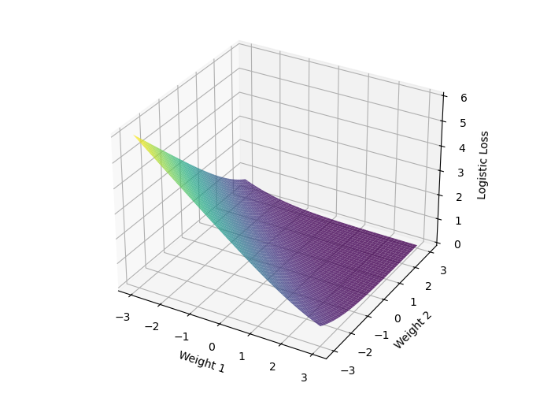
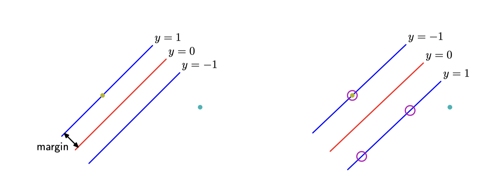

# Lecture reminder

# Convex Sets

## Line Segment

Suppose $x_1, x_2$ are two points in $\mathbb{R^n}$. Then the line segment between them is defined as follows:

$$
x = \theta x_1 + (1 - \theta)x_2, \; \theta \in [0,1]
$$

{width=200}

## Convex Set

The set $S$ is called **convex** if for any $x_1, x_2$ from $S$ the line segment between them also lies in $S$, i.e. 

$$
\forall \theta \in [0,1], \; \forall x_1, x_2 \in S: \theta x_1 + (1- \theta) x_2 \in S
$$

::: {.callout-example}
Any affine set, a ray, a line segment - they all are convex sets.
:::

{width=200}

## Problem 1

::: {.callout-question}
Prove, that ball in $\mathbb{R}^n$ (i.e. the following set $\{ \mathbf{x} \mid \Vert \mathbf{x} - \mathbf{x}_c \Vert \leq r \}$) - is convex.
:::

## Problem 2

::: {.callout-question}
Is stripe - $\{x \in \mathbb{R}^n \mid \alpha \leq a^\top x \leq \beta \}$ - convex?
:::

## Problem 3

::: {.callout-question}
Let $S$ be such that $\forall x,y \in S \to \frac{1}{2}(x+y) \in S$. Is this set convex?
:::

## Problem 4

::: {.callout-question}
The set $S = \{x \; | \; x + S_2 \subseteq S_1\}$, where $S_1,S_2 \subseteq \mathbb{R}^n$ with $S_1$ convex. Is this set convex?
:::

# Functions

## Convex Function

The function $f(x)$, **which is defined on the convex set** $S \subseteq \mathbb{R}^n$, is called **convex** on $S$, if:

$$
f(\lambda x_1 + (1 - \lambda)x_2) \le \lambda f(x_1) + (1 - \lambda)f(x_2)
$$

for any $x_1, x_2 \in S$ and $0 \le \lambda \le 1$.  
If the above inequality holds as strict inequality $x_1 \neq x_2$ and $0 < \lambda < 1$, then the function is called **strictly convex** on $S$.

{width=250}

## Strong Convexity

$f(x)$, **defined on the convex set** $S \subseteq \mathbb{R}^n$, is called $\mu$-strongly convex (strongly convex) on $S$, if:

$$
f(\lambda x_1 + (1 - \lambda)x_2) \le \lambda f(x_1) + (1 - \lambda)f(x_2) - \frac{\mu}{2} \lambda (1 - \lambda)\|x_1 - x_2\|^2
$$

for any $x_1, x_2 \in S$ and $0 \le \lambda \le 1$ for some $\mu > 0$.

{width=250}

# Criteria of Convexity

## First-order differential criterion of convexity
The differentiable function $f(x)$ defined on the convex set $S \subseteq \mathbb{R}^n$ is convex if and only if $\forall x,y \in S$:

$$
f(y) \ge f(x) + \nabla f^T(x)(y-x)
$$

Let $y = x + \Delta x$, then the criterion will become more tractable:

$$
f(x + \Delta x) \ge f(x) + \nabla f^T(x)\Delta x
$$

{width=200}

## Second-order differential criterion of strong convexity
Twice differentiable function $f(x)$ defined on the convex set $S \subseteq \mathbb{R}^n$ is called $\mu$-strongly convex if and only if $\forall x \in \mathbf{int}(S) \neq \emptyset$:

$$
\nabla^2 f(x) \succeq \mu I
$$

In other words:

$$
\langle y, \nabla^2f(x)y\rangle \geq \mu \|y\|^2
$$

## Motivational Experiment with JAX

Why convexity and strong convexity is important? Check the simple [\faPython code snippet](https://colab.research.google.com/drive/14qPF7fkCWAoKcmFbN0Up4V0LMR287Nch?usp=sharing).

## Problem 5

::: {.callout-question}
Show, that $f(x) = \|x\|$ is convex on $\mathbb{R}^n$.
:::

::: {.callout-question}
Show, that $f(x) = x^\top Ax$, where $A\succeq 0$ - is convex on $\mathbb{R}^n$.
:::

## Problem 6

::: {.callout-question}
Show, that if $f(x)$ is convex on $\mathbb{R}^n$, then $\exp(f(x))$ is convex on $\mathbb{R}^n$.
:::

## Problem 7

::: {.callout-question}
If $f(x)$ is convex nonnegative function and $p \ge 1$. Show that $g(x)=f(x)^p$ is convex.
:::

## Problem 8

::: {.callout-question}
Show that, if $f(x)$ is concave positive function over convex S, then $g(x)=\frac{1}{f(x)}$ is convex.
:::

::: {.callout-question}
Show, that the following function is convex on the set of all positive denominators
$$
f(x) = \dfrac{1}{x_1 - \dfrac{1}{x_2 - \dfrac{1}{x_3 - \dfrac{1}{\ldots}}}}, x \in \mathbb{R}^n
$$
:::

## Problem 9

::: {.callout-question}
Let $S = \{x \in \mathbb{R}^n \; \vert \; x \succ 0, \Vert x \Vert_{\infty} \leq M \}$. Show that $f(x)=\sum_{i=1}^n x_i \log x_i$ is $\frac{1}{M}$-strongly convex.
:::

# PL-Condition

## Polyak-Lojasiewicz (PL) Condition

PL inequality holds if the following condition is satisfied for some  $\mu > 0$,
$$
\Vert \nabla f(x) \Vert^2 \geq \mu (f(x) - f^*) \forall x
$$
The example of a function, that satisfies the PL-condition, but is not convex.
$$
f(x,y) = \dfrac{(y - \sin x)^2}{2}
$$

Example of Pl non-convex function [\faPython Open in Colab](https://colab.research.google.com/github/MerkulovDaniil/optim/blob/master/assets/Notebooks/PL_function.ipynb).

# Practical examples

## Logistic regression

::: {.columns}
::: {.column width=60%}
::: {.callout-note}
## Given
Data:

$X \in \mathbb{R}^{m \times n}, y \in \{0, 1\}^n$.
:::

::: {.callout-important}
## To find
Find function, that translates object $x$ to probability $p(y=1| x)$:

$p: \mathbb R^m \to (0, 1)$, $p(x) \equiv \sigma(x^Tw) = \frac{1}{1 + \exp(-x^T w)}$
:::

::: {.callout-tip}
## Criterion
Binary cross-entropy (logistic loss):

$L(p, X, y) = -\sum_{i=1}^n y_i \log p\left( X_i \right) + \left( 1 - y_i \right) \log \left(1 - p\left( X_i \right) \right),$
that is minimized with respect to $w$.
:::
:::
::: {.column width=38%}
  
:::
:::

We can make this problem $\mu$-strongly convex if we consider regularized logistic loss as criterion: $L(p, X, y) + \frac{\mu}{2} \| w \|_2^2$.

Check the [\faPython\ logistic regression experiments](https://colab.research.google.com/github/MerkulovDaniil/hse25/blob/main/notebooks/s4_benchmarx_convex.ipynb).

## Support Vector Machine (SVM)

::: {.columns}
::: {.column width=60%}
::: {.callout-note}

## Given

Data:

$X \in \mathbb{R}^{m \times n}, y \in \{-1, 1\}^n$.
:::

::: {.callout-important}

## To find

Find a hyperplane that maximizes the margin between two classes:

$f: \mathbb{R}^m \to \{-1, 1\},\ f(x) = \text{sign}(w^T x + b)$.
:::

::: {.callout-tip}

## Criterion

Hinge loss:

$L(w, X, y) = \frac{1}{2} \|w\|_2^2 + C\sum_{i=1}^n \max(0, 1 - y_i (X_i^T w + b)),$
that is minimized with respect to $w$ and $b$.

:::

This problem is strongly-convex due to squared Euclidean norm.

Check the [\faPython\ SVM experiments in the same notebook](https://colab.research.google.com/github/MerkulovDaniil/hse25/blob/main/notebooks/s4_benchmarx_convex.ipynb).

:::
::: {.column width=38%}

:::
:::

<!-- We can make this problem $\mu$-strongly convex by adding an L2 regularization term: -->
<!-- $$L(w, X, y) + \frac{\mu}{2} | w |_2^2.$$ -->

<!-- Check the \faPython\ SVM experiments. -->

<!-- TODO: do the same for SVM, slide on couple other important examples without proof and code. -->

